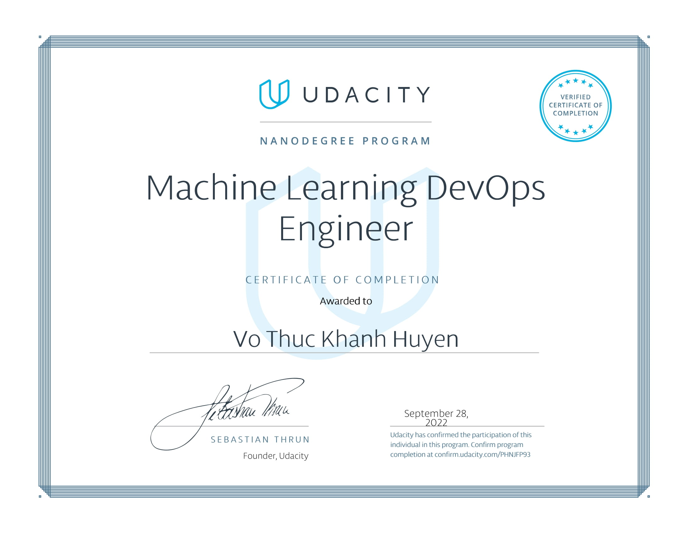

# machine-learning-devops-engineer-nanodegree-udacity

## Overview
The Machine Learning DevOps Engineer Nanodegree program focuses on the software engineering 
fundamentals needed to successfully streamline the deployment of data and machine-learning models 
in a production-level environment. Students will build the DevOps skills required to automate the various 
aspects and stages of machine learning model building and monitoring over time.

## Educational Objectives: 
Students who graduate from the program will be able to:
- Implement production-ready Python code/processes for deploying ML models outside of 
cloud-based environments facilitated by tools such as AWS SageMaker, Azure ML, etc. 
- Engineer automated data workflows that perform continuous training (CT) and model
validation within a CI/CD pipeline based on updated data versioning
- Create multi-step pipelines that automatically retrain and deploy models after data updates
- Track model summary statistics and monitor model online performance over time to prevent 
model-degradation

## [Certificate](https://confirm.udacity.com/PHNJFP93)
